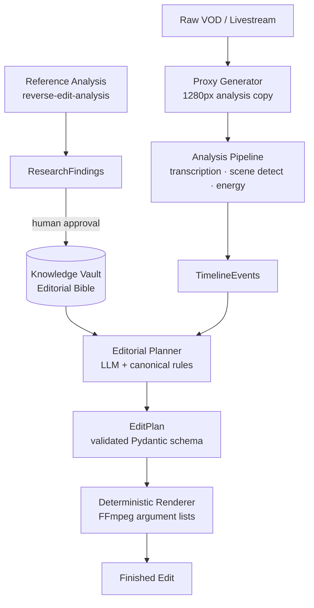

# StreamEditor AI

> **Reconstruct the livestream experience.** Not a highlight generator — an editorial AI that learns how a creator edits and reproduces their aesthetic to transform a raw VOD into a finished production.

---

## What This Is

StreamEditor AI analyzes a creator's existing edited content, extracts their **EditDNA** — the set of temporal, visual, and tonal decisions that define their style — then applies that style autonomously to new livestream VODs.

The output is not a clip reel. It is a **faithful reconstruction** of what a skilled editor would have produced: pacing, transitions, zoom emphasis, narrative flow, and tonal arc intact.

### What It Is NOT

- ❌ A highlight clipper (those extract moments; this reconstructs narratives)
- ❌ A template-based tool (the style is learned, not configured)
- ❌ A chatbot that edits (an LLM never executes commands; only `EditPlan` schemas do)

---

## Architecture



**Key invariant:** LLMs produce structured `EditPlan` schemas. Deterministic software executes them. No model ever runs a shell command.

---

## Quick Start (Docker)

```bash
# 1. Clone and configure
git clone <repo-url> stream-editor-ai
cd stream-editor-ai
cp .env.example .env

# 2. Start all services
make up

# 3. Check services are healthy
docker-compose ps

# 4. Apply database migrations
make migrate
```

Services:
- API: http://localhost:8000
- Web: http://localhost:3000
- Postgres: localhost:5432
- Redis: localhost:6379

---

## Development Setup

### Prerequisites

- [uv](https://docs.astral.sh/uv/) — Python package manager
- [Node.js 20+](https://nodejs.org/) — for the web frontend
- [Docker Desktop](https://www.docker.com/products/docker-desktop/) — for postgres/redis
- [FFmpeg](https://ffmpeg.org/) — for media processing (local dev)

### Local Development

```bash
# Start backing services only (postgres + redis)
make dev

# Install all Python dependencies
make install

# Apply DB migrations
make migrate

# Generate synthetic test media
uv run python scripts/generate_test_media.py

# Run tests
make test

# Run linters
make lint

# Check vault consistency
make check-vault
```

### Running the API locally

```bash
cd apps/api
uv run uvicorn stream_editor.api.main:app --reload --host 0.0.0.0 --port 8000
```

### Running the worker locally

```bash
uv run celery -A stream_editor.worker.celery_app worker --loglevel=info
```

---

## Tech Stack

| Layer | Technology |
|-------|-----------|
| API | FastAPI + Python 3.12 |
| Worker | Celery + Redis |
| Database | PostgreSQL 16 + SQLAlchemy async |
| Frontend | Next.js 14 (App Router) |
| Media | FFmpeg / FFprobe |
| AI Models | Gemini / Anthropic (via ModelProvider abstraction) |
| Validation | Pydantic v2 |
| Packaging | uv workspace |
| Docs | Obsidian knowledge vault |
| Rendering | Remotion (rich overlays) |

---

## Knowledge Vault

The `knowledge-vault/` directory is an Obsidian vault containing all project documentation, editorial rules, research findings, and architecture decisions.

It is the **source of truth**. Code follows the vault, not vice versa.

Key documents:
- [`00_HOME/README.md`](knowledge-vault/00_HOME/README.md) — navigation index
- [`00_HOME/PROJECT_STATUS.md`](knowledge-vault/00_HOME/PROJECT_STATUS.md) — current state
- [`01_PRODUCT/PRODUCT_VISION.md`](knowledge-vault/01_PRODUCT/PRODUCT_VISION.md) — vision
- [`02_ARCHITECTURE/SYSTEM_OVERVIEW.md`](knowledge-vault/02_ARCHITECTURE/SYSTEM_OVERVIEW.md) — architecture
- [`03_EDITORIAL_BIBLE/`](knowledge-vault/03_EDITORIAL_BIBLE/) — canonical editorial rules

---

## Current Status

**Milestone:** M0 — Foundation (in progress)

See [`PROJECT_STATUS.md`](knowledge-vault/00_HOME/PROJECT_STATUS.md) for detailed status.

---

## Contributing

> [!IMPORTANT]
> All contributors (human and AI) must read `AGENTS.md` before making changes.

1. Read `AGENTS.md` completely
2. Create a feature branch: `git checkout -b feat/your-feature`
3. Make changes following coding standards in `AGENTS.md`
4. Run `make test-all` — must pass before PR
5. Update `PROJECT_STATUS.md` and `CHANGELOG.md`
6. Open a pull request with a description of architectural decisions made

---

## License

Proprietary — StreamEditor AI. All rights reserved.