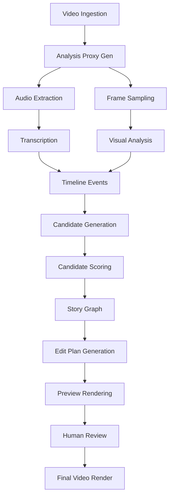

# Data Flow

```mermaid
flowchart TD
    Ingest[Video Ingestion] --> Proxy[Analysis Proxy Gen]
    Proxy --> Audio[Audio Extraction]
    Proxy --> Frames[Frame Sampling]
    Audio --> Transcribe[Transcription]
    Frames --> Vision[Visual Analysis]
    Transcribe --> Timeline[Timeline Events]
    Vision --> Timeline
    Timeline --> Candidates[Candidate Generation]
    Candidates --> Score[Candidate Scoring]
    Score --> Story[Story Graph]
    Story --> EditPlan[Edit Plan Generation]
    EditPlan --> Render[Preview Rendering]
    Render --> Human[Human Review]
    Human --> FinalRender[Final Video Render]
```
