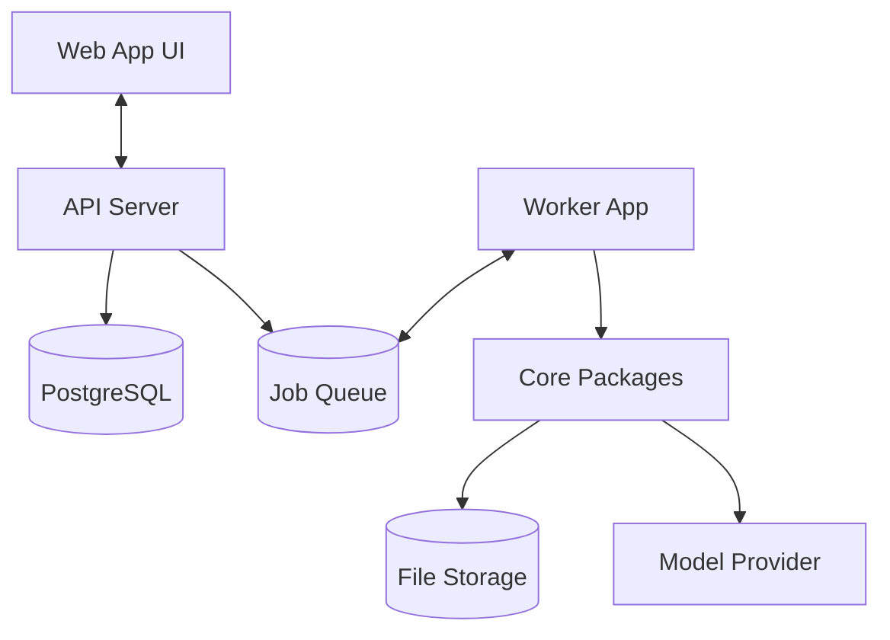

# System Overview

StreamEditor AI is a monorepo containing multiple apps and packages.

## Components
- **Apps:** api, worker, web
- **Packages:** contracts, media, analysis, editorial, research, models, rendering, storage, vault
- **Renderers:** FFmpeg (core ops), Remotion (rich overlays)

